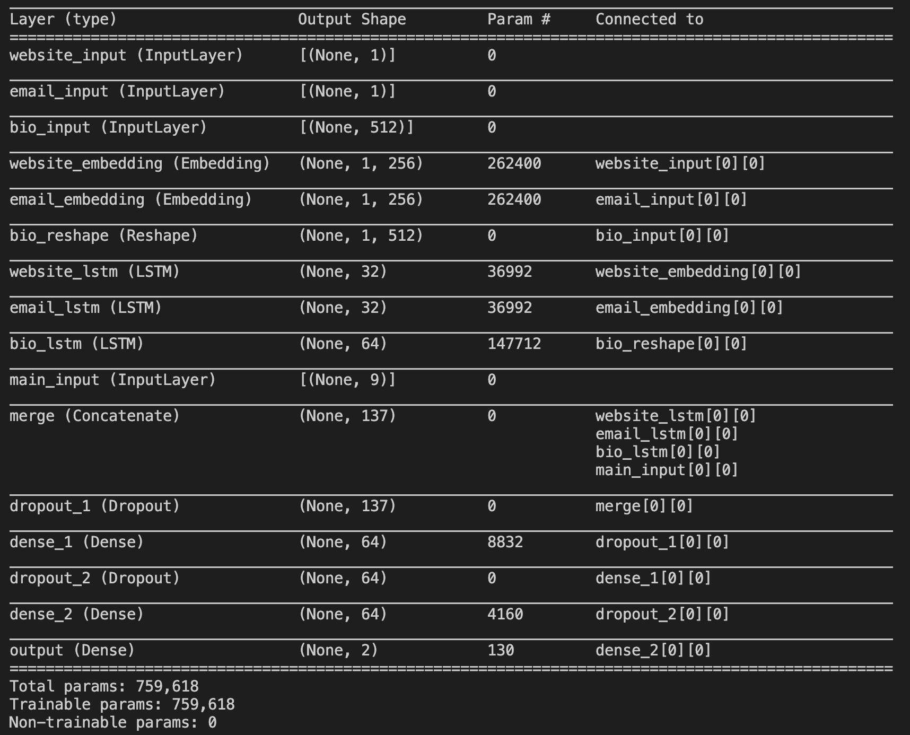

# LodBrok model

LodBrok is an LSTM model trained to detect the editor spam accounts in [MusicBrainz](https://musicbrainz.org/doc/MusicBrainz_Database/Schema). The model trained so far is done through offline batch training on private editor dataset and will be integrated with [MusicBrainz](https://musicbrainz.org/) project through [SpamNinja](https://tickets.metabrainz.org/browse/MBS-9480) feature in the future.

## Network layout


Lodbrok receives four different inputs which are sub-arrays of the pre-processed input datum. The website and email inputs have respectively been tokenized to their top 1024 entries and are embedded into 256-dimensional vectors. Meanwhile the user biography input is just reshaped into one 512-dimensional vector, as it is already quasi-embedded.

All three inputs are then passed into LSTMs where the bio-LSTM has an output twice as large as the others.

The outputs of the LSTMS are then concatenated with the other inputs (area set, non-zero privs, bio length, etc.) and passed into a stack of two fully-connected layers with 64 neurons and 50% dropout each.

The output layer consists of two neurons that represent the classification confidence for each category (spam and non-spam) and are activated using softmax so that their sum will always be one.


## Working

First, run the below command in a virtual environment with the terminal active in root directory.

Install Python 3 requirements.
```
pip3 install -r requirements.txt
```


The model is trained on editor account details like name, website, bio etc. As the model takes input as integers, the data is preprocessed to numbers as follows:

### Data preprocssing

```
data = np.array([
        1,#spam classification(spam or not)
        1,# Area Set
        1,# Gender given
        1,# Birth date set(bool)
        1,# Nonzero editor privs(bool)
        0,# Bio length
        0,#bio_urls, # URLs in bio
        -2,#conf_delta, # Confirmation delta
        -2,# Last updated delta
        -2,#Last login delta
        1,# Email domain
        1,#website_token, # Website domain
    ], dtype=np.float32)
    
```

This is then combined with bio and after converting the whole dataset it is then kept in a pickle file 

```
data = np.concatenate((data, bio))

with open("spambrainz_dataset.pickle", "wb") as f:
    pickle.dump(data, f)
```

### Model training

The pickle file is then used in the model to train:
1) Load the "spambrainz_dataset.pickle" file and train the model with it .
```
m = get_model()
train_model(model, training_data, [tensorboard])
```
 2) Save the model obtained to be used later:
 ```
 model.save("lodbrok1.h5")
 ```
This will store the model in a h5 type file, which later can be used to load the model for evaluation. The summary of the trained model is as follows:


### Model evaluation

1) Another pickle file is created to evaluate the model that we trained, this is stored in "spambrainz_dataset_eval.pickle" file. 
2) It is then evaluated with the model we saved earlier in "eval.py". This will show how accurately the model fairs against the eval data. This is useful to avoid overfitting or underfitting of the model.

This is the result of evaluation done on:


### Model prediction

1) New dataset named "spambrainz_dataset_predict.pickle" is used to test the model predictions and how accurate it is with new data.
2) The check_predict.py predicts the data given without any label specifying the type of editor account.

In summary the Lodbrok model achieves a very high spam detection rate while simultaneously maintaining a low false positive rate. Data falsely classified by the model should be further examined to determine whether it really is part of the right dataset or whether there is a deficit of a certain type of data.


